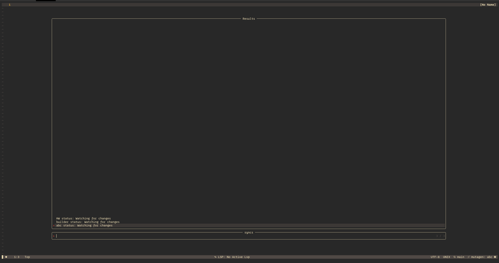
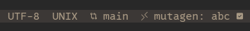

# mutagen.nvim
Small plugin that provides some utils to interact with mutagen through neovim.
## Features
- Auto flush sync after buffer write
- Telscope integration
- Sync status indicator in e.g. lualine
## Install
```lua
  {
    "lothran/mutagen.nvim",
    opts = {}
  },
```
## Telescope


```lua
  {
    "nvim-telescope/telescope.nvim",
    dependencies = {
      "lothran/mutagen.nvim",
    },
    keys = {
      { "<space>ml",  "<CMD>Telescope mutagen<CR>",                               mode = { "n", "v" } },
    },
    config = function()
      require('telescope').load_extension('mutagen')
    end
  },
```
- enter to flush a sync
- `<ctrl-t>` to terminate a sync (note this done by simple name matching, if two have the same name both will be terminated)

## Lualine

```lua
-- Inserts a component in lualine_x at right section
local function ins_right(component)
  table.insert(config.sections.lualine_x, component)
end
ins_right {
  function()
    local mutagen = require("mutagen")
    local sync = mutagen.sync_find()
    local symbols = { ' ', ' ' }
    local status = 0
    if sync == nil then
      return "None"
    else
      if mutagen.sync_connected(sync) then
        status = 1
      else
        status = 2
      end
      return sync.name .. symbols[status]
    end
  end,
  icon = ' mutagen:',

}
```
